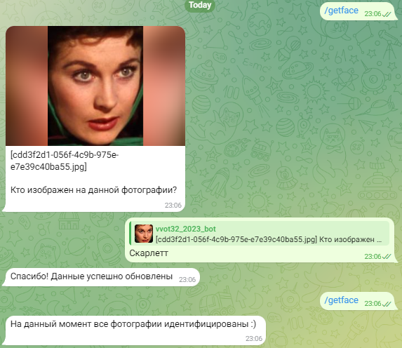
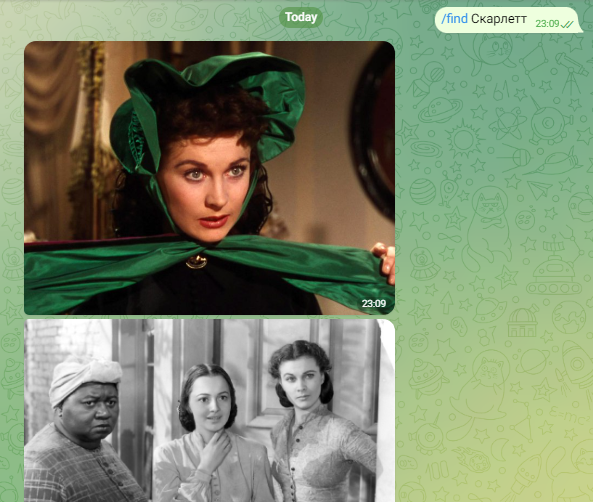
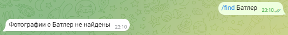

# Домашнее задание №1. Обработка фотографий с лицами людей

### *Савинчева Ангелина, 11-001*

## Созданный бот
* Бот доступен по ссылке: [Telegram-бот](https://t.me/vvot32_2023_bot)

## Инструкция к запуску
* В файле **terraform.tfvars** необходимо подставить значения следующих переменных:
  * `tgkey` - Telegram-ключ для бота;
  * `bot_name` - Username Telegram-бота. Например, "vvot32_2023_bot";
  * `cloud_id` - ID Yandex-облака;
  * `cloud_sa_key` - Файл с ключом сервисного аккаунта Yandex Cloud. Например, "key.json";
  * `folder_id` - ID каталога Yandex Cloud.

## Функционал
* `/getface` - загрузка неидентифицированной фотографии и обновление данных об имени

* `/find {name}` - поиск оригинальных фотографий по имени

* 

